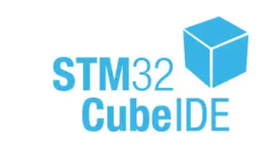
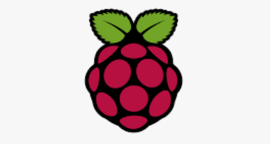
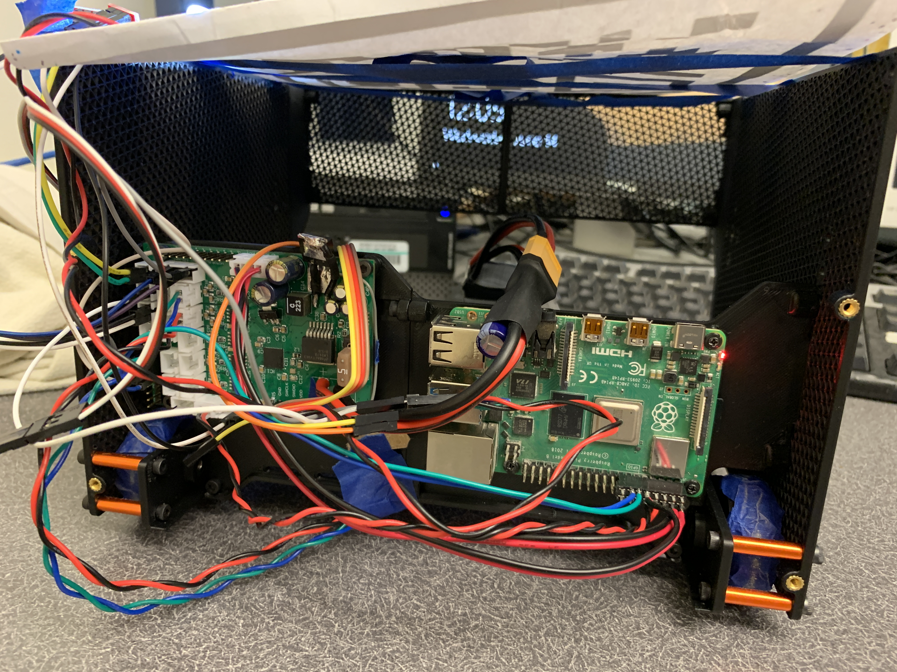
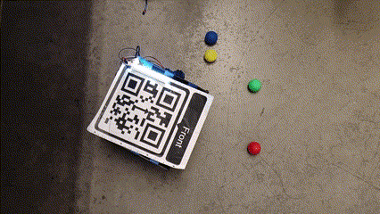
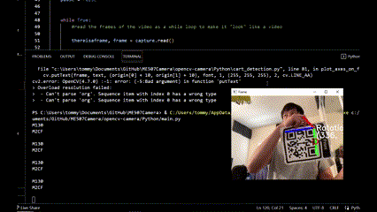

<!-- Improved compatibility of back to top link: See: https://github.com/othneildrew/Best-README-Template/pull/73 -->

<!--
*** Thanks for checking out the Best-README-Template. If you have a suggestion
*** that would make this better, please fork the repo and create a pull request
*** or simply open an issue with the tag "enhancement".
*** Don't forget to give the project a star!
*** Thanks again! Now go create something AMAZING! :D
-->

<!-- PROJECT SHIELDS -->
<!--
*** I'm using markdown "reference style" links for readability.
*** Reference links are enclosed in brackets [ ] instead of parentheses ( ).
*** See the bottom of this document for the declaration of the reference variables
*** for contributors-url, forks-url, etc. This is an optional, concise syntax you may use.
*** https://www.markdownguide.org/basic-syntax/#reference-style-links
-->
[![Contributors][contributors-shield]][contributors-url]
[![MIT License][license-shield]][license-url]

<!-- PROJECT LOGO -->
 

  

<h3 align="center">Hungry Hippo Robot</h3>

  

    The Hungry Hippo Robot project was a graduate level design term project for Cal Poly. We were tasked to build a robot to automously navigate an arena, pick up ping pong balls, and sort them based on color.
     
    <a href="https://github.com/tommy20gun/Hungry-Hippo-Robot"><strong>Explore the docs »</strong></a>
     
     
  

<!-- TABLE OF CONTENTS -->

  
Table of Contents

  <ol>
    <li>
      <a href="#about-the-project">About The Project</a>
      <ul>
        <li><a href="#Applications-used">Applications Used</a></li>
      </ul>
    </li>
    </li>
    <li><a href="#Mechanical-Design">Mechanical Design</a></li>
    <li><a href="#Electrical-Design">Electrical Design</a></li>
    <li><a href="#Software-Implementation">Software Implementation</a></li>
    <li><a href="#license">License</a></li>
    <li><a href="#contact">Contact</a></li>
    <li><a href="#acknowledgments">Acknowledgments</a></li>
  </ol>

<!-- ABOUT THE PROJECT -->
<h2 align="center">About This Project</h2>

    <table>
	    <tr>
    	    <td style="padding:10px">
        	    
      	    </td>
            <td style="padding:10px">
            	
            </td>
        </tr>
    </table>

<!--![Product Name Screen Shot][coverpage]
![Product Name Screen Shot][back]-->

The Hungry Hippo Robot is a robot built to play a competitive game of Hungry Hippo in the arena(right). 
* The robot starts at its home-base
* The arena is scattered with ping pong balls
* The robot must collect then deposit the correct colored ball of it's home base color
* The robot must sort the ping pong balls, eliminating undesired colors
* The robot must deposit the balls in the center to earn 1 point

(<a href="#readme-top">back to top</a>)

### Applications Used

* [][STM32Cube-url]
*  [][OpenCV-url]
*  [][raspberrypi-url]

(<a href="#readme-top">back to top</a>)

<!-- Mechanical Design -->
<h2 align="center">Mechanical Design</h2>

![Robot CAD][robot_cad]

<a href="https://drive.google.com/drive/folders/1YNU8u0PBZDRhuVai56NaG6UMePA88sIG?usp=sharing"><strong>Explore the CAD » </strong> </a>

Our robot design features a large basket housing the drive wheels, electronics, and battery, with intake rollers bringing balls from the floor into the basket. A ball wheel on the back of the basket arranges the balls in a single file on a shelf. The balls then pass through a color sensor and a series of servos. If a ball matches the team color it continues rolling along the shelf, otherwise, it is knocked back into the basket. 

During a match, the robot drives around to collect balls, separating designated-color balls for later depositing and dropping the rest onto the arena. Once enough designated-color balls are collected, they are either shot into the arena center.

(<a href="#readme-top">back to top</a>)

<!-- Electronic Design -->
<h2 align="center">Electrical Design</h2>

![PCB][pcb]

<a href="https://github.com/tommy20gun/Hungry-Hippo-Robot"><strong>Explore the eCAD » </strong> </a>

### Power
The custom PCB takes power from the 3S LiPo rechargable battery. Current passes through a 5A switching regulator to supply 5V power to the Raspberry Pi, and finally a 3A linear regulator to supply 3V3 power to the microcontroller and sensors. 

  

### Features
* 5 motor outputs
* 2 servo outputs
* 9 microcontroller header pins
* Hall sensor input
* UART6 communication with the ST Link
* UART 1 communication with the Raspberry Pi
* I2C line
* Many extra JST connectors for 3.3V, 5V, and 12V power. 
* Emergency 10 Headers for motor input only  

### Sensors

* The ambient light sensor using ADC
* The color sensor using I2C
* Hall sensor using GPIO Input
* Kill Switch using GPIO External Interrupt triggered by Raspberry Pi

(<a href="#readme-top">back to top</a>)

<!-- Software Implementation -->
<h2 align="center">Software Implementation</h2>

### Achieving Wireless Communication

![wirelesscommunication][wirelesscom]

The robot connects to a computer in 3 steps. First, we use UART to connect a Raspberry Pi to the MCU. The Raspberry Pi hosts a server, which a computer, a camera, and the raspberry Pi itself can connect to. This enables communication between the computer running Python and the Robot. 

### STM32IDE - C++

The C++ code implements a finite state machine in the main loop with 4 states.

**State 0**: Start state. In this state, the robot does nothing except wait for a signal to start. A GPIO interrupt triggered by the Raspberry PI (triggered by the user) brings the state machine to state 1.

**State 1**: 

  

The robot looks for a ball and moves towards it if it finds one.

Here, the crux of the logic is inside the python scripts that were written for the robot. Here is where the UART1 Receive Interrupt is active. The robot will actively take motor duty cycle data given by the CPython program through UART1 to know how to drive itself. 

Code in C++ only contains checking on the ADC reading of the light sensor. If the light reading falls below a certain threshold, the state machine will move into state 2.

State 2:

  

The purpose of state 2 is to correct the robot if it runs out of the arena. The robot will move backwards in state 2. 

The light sensor has a threshold value of 400 units that, when the reading is below, will automatically trigger the robot into state 2. When the sensor is faced downward, the light value should only drop below 400 units when the robot moves outside of the arena. 

**State 3** 

    <table>
	    <tr>
    	    <td style="padding:10px">
        	    
      	    </td>
            <td style="padding:10px">
            	
            </td>
        </tr>
    </table>

Blue ping pong ball (left), Red Ping pong ball (right).

This is the ball sorting state. The color sensor is an I2C device that returns values of RGB based on what it sees. The determineColor() function selects the RGB value with the biggest magnitude and determines the ball’s color based on the color with the biggest signal. A blue ping pong ball will trigger the left servo. A red ping pong ball will trigger the right servo. A green ping pong ball resets the servos.  

*Due to time constraints, we were not able to fully implement this portion of the robot.

**State 4**

  

This is the Pause state. The sole purpose of this state is to act as the dead man’s switch. The code can be paused at any point in time where the user presses ‘Space Bar’ with the Python program opened. The computer would send an instruction to the Raspberry Pi that triggers a GPIO interrupt in the MCU to put the robot into its pause state. 

(<a href="#readme-top">back to top</a>)

### Opencv Python

  

Within Cpython, the OpenCV Library is implemented. The order of logic is as follows. 

* The camera detects Ball and Cart objects and sets the robot to spin in a circle until the front of the robot faces the ball.

* When the robot faces the ball, then it will activate a proportional controller (P-controller) that drives it towards the ball to capture it.

* If there are no balls, the Python program will send an instruction to the Raspberry Pi to trigger an interrupt for the MCU to move the state machine into state 3.
 
* CPython is active at all times and sends motor duty cycle to the robot at all times, but the MCU only activates Python control in Robot's State 1.

<!-- LICENSE -->
## License

Distributed under the MIT License. See `LICENSE-MIT.txt` for more information.

(<a href="#readme-top">back to top</a>)

<!-- CONTACT -->
## Contact

Tommy Xu tommy20gun00@gmail.com 

Ryan Ghosh rghosh776@gmail.com

Project Link: [https://github.com/tommy20gun/Hungry-Hippo-Robot](https://github.com/tommy20gun/Hungry-Hippo-Robot)

(<a href="#readme-top">back to top</a>)

<!-- ACKNOWLEDGMENTS -->
## Acknowledgments
* Charlie Refvem: Prof. Mechanical Engineering
* [https://github.com/TemugeB/QR_code_orientation_OpenCV](https://github.com/TemugeB/QR_code_orientation_OpenCV)
* [https://realpython.com/python-sockets/](https://realpython.com/python-sockets/)
* [https://stackoverflow.com/questions/30032063/opencv-videocapture-lag-due-to-the-capture-buffer](https://stackoverflow.com/questions/30032063/opencv-videocapture-lag-due-to-the-capture-buffer)

(<a href="#readme-top">back to top</a>)

<!-- MARKDOWN LINKS & IMAGES -->
<!-- https://www.markdownguide.org/basic-syntax/#reference-style-links -->
[contributors-shield]: https://img.shields.io/github/contributors/tommy20gun/Hungry-Hippo-Robot.svg?style=for-the-badge
[contributors-url]: https://github.com/tommy20gun/Hungry-Hippo-Robot/graphs/contributors
[license-shield]: https://img.shields.io/github/license/tommy20gun/Hungry-Hippo-Robot.svg?style=for-the-badge
[license-url]: https://github.com/tommy20gun/Hungry-Hippo-Robot/blob/master/LICENSE.txt
[product-screenshot]: images/screenshot.png
[robot_cad]: images/robot_cad.png
[pcb]: images/pcb.PNG
[STM32CubeIDE]:images/stm32cubeIDE.PNG
[STM32Cube-url]:https://www.st.com/en/development-tools/stm32cubeide.html
[OpenCV]:images/opencvlogo.PNG
[OpenCV-url]:https://opencv.org
[raspberrypi-url]:https://www.raspberrypi.com
[opencvdemo]:images/Opencvdemo.png
[coverpage]:images/coverpage.jpg
[robotstate1]:images/robotworking.gif.gif
[robotstate2]:images/robotstate2.gif.gif
[bluecolorball]:images/colorsensor%20blue%20-%20Made%20with%20Clipchamp.gif
[redcolorball]:images/redball%20-%20Made%20with%20Clipchamp.gif
[pause]:images/pause.gif
[arena]:images/arena.PNG
[back]:images/robotback.jpg
[wirelesscom]:images/wireless%20communication.PNG
[opencvcartdetection]:images/ball%20cart%20detection.gif
[opencvreactivemotorduty]:images/reactivemotorduty.gif